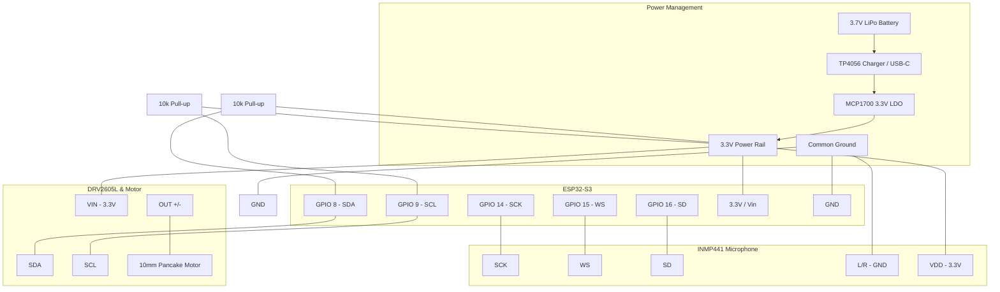

***

# EGEC 463: Voice-Based Stress Analysis (Group 6)
**Author:** Willie Jarin

## 1. Project Overview
This project features a neck-worn wearable capable of detecting physiological stress through vocal micro-tremors—specifically **Jitter** (frequency variation) and **Shimmer** (amplitude variation). 

The system operates as a **Real-Time Closed-Loop**:
1. **Stage 1 (Capture):** ESP32-S3 captures audio via I2S and streams raw binary data at **921,600 Baud**.
2. **Stage 2 (Bridge):** A Python script encapsulates the high-speed stream into a `.wav` file locally.
3. **Stage 3 (Analysis):** A MATLAB engine extracts biomarkers, visualizes data, and executes detection logic.
4. **Stage 4 (Feedback):** A haptic command is pushed back to the wearable to trigger a vibration alert.

---

## 2. Hardware Specifications & BOM

### Unified Wiring Key
| Component | Signal Type | ESP32-S3 Pin | Purpose |
| :--- | :--- | :--- | :--- |
| **INMP441 Mic** | **I2S (Digital Audio)** | GPIO 14, 15, 16 | Captures vocal biomarkers. |
| **DRV2605L Driver** | **I2C (Control)** | GPIO 8, 9 | Controls haptic feedback (Req. 10k Pull-ups). |
| **MCP1700 LDO** | **Power** | 3.3V Out | Regulates battery to steady 3.3V. |
| **TP4056 Module** | **Power** | LiPo & USB-C | Safely charges the 3.7V battery. |

### Bill of Materials (Total Cost: $73.86)
| Item | Manufacturer/Description | Cost |
| :--- | :--- | :--- |
| **Main MCU** | Espressif ESP32-S3-DevKitC-1 | $15.00 |
| **MEMS Mic** | INMP441 Breakout Board | $6.99 |
| **Haptic Driver** | TI DRV2605L Breakout | $7.95 |
| **Power** | 3.7V 1000mAh LiPo & TP4056 Charger | $16.48 |
| **Connectivity** | 22AWG Wire / 10k Resistors / Perfboard | $18.95 |

---

## 3. Firmware: ESP32-S3 (`EGEC463_Project.ino`)
*Configured for 16kHz/32-bit I2S acquisition and I2C haptic control.*

```cpp
/*
 * Project: Neck-Worn Wearable for Voice-Based Stress Analysis
 * Hardware: ESP32-S3, INMP441 MEMS Microphone, DRV2605L Haptic Driver
 */

#include <driver/i2s.h>
#include <Wire.h>
#include "Adafruit_DRV2605.h"

// I2S Mic Pins
#define I2S_WS 15
#define I2S_SD 16
#define I2S_SCK 14
#define I2S_PORT I2S_NUM_0
#define BUFFER_LEN 512

// DRV2605L I2C Pins
#define I2C_SDA 8
#define I2C_SCL 9

Adafruit_DRV2605 drv;

void triggerStressAlert() {
  drv.setWaveform(0, 47);  // sharp click
  drv.setWaveform(1, 0);   // end waveform
  drv.go();
}

void setup() {
  Serial.begin(921600);
  delay(1000);

  // Start I2C for DRV2605L
  Wire.begin(I2C_SDA, I2C_SCL);

  if (!drv.begin()) {
    Serial.println("DRV2605L not found");
  } else {
    drv.selectLibrary(1);
    drv.setMode(DRV2605_MODE_INTTRIG);
    Serial.println("DRV2605L_READY");
  }

  // I2S Configuration
  const i2s_config_t i2s_config = {
    .mode = (i2s_mode_t)(I2S_MODE_MASTER | I2S_MODE_RX),
    .sample_rate = 16000,
    .bits_per_sample = I2S_BITS_PER_SAMPLE_32BIT,
    .channel_format = I2S_CHANNEL_FMT_ONLY_LEFT,
    .communication_format = I2S_COMM_FORMAT_STAND_I2S,
    .intr_alloc_flags = ESP_INTR_FLAG_LEVEL1,
    .dma_buf_count = 8,
    .dma_buf_len = BUFFER_LEN,
    .use_apll = false,
    .tx_desc_auto_clear = false,
    .fixed_mclk = 0
  };

  const i2s_pin_config_t pin_config = {
    .bck_io_num = I2S_SCK,
    .ws_io_num = I2S_WS,
    .data_out_num = -1,
    .data_in_num = I2S_SD
  };

  esp_err_t err;

  err = i2s_driver_install(I2S_PORT, &i2s_config, 0, NULL);
  if (err != ESP_OK) {
    Serial.println("I2S driver install failed");
    while (true);
  }

  err = i2s_set_pin(I2S_PORT, &pin_config);
  if (err != ESP_OK) {
    Serial.println("I2S pin setup failed");
    while (true);
  }

  i2s_zero_dma_buffer(I2S_PORT);

  Serial.println("ESP32_READY");
}

void loop() {
  int32_t samples[BUFFER_LEN];
  size_t bytes_read = 0;

  esp_err_t result = i2s_read(
    I2S_PORT,
    samples,
    sizeof(samples),
    &bytes_read,
    portMAX_DELAY
  );

  if (result == ESP_OK && bytes_read > 0) {
    int samples_read = bytes_read / sizeof(int32_t);

    for (int i = 0; i < samples_read; i++) {
      Serial.println(samples[i]);
    }
  }

  if (Serial.available() > 0) {
    char command = Serial.read();

    if (command == 'S') {
      triggerStressAlert();
      Serial.println("HAPTIC_ALERT_TRIGGERED");
    }
  }
}


```

---

## 4. Serial Bridge: Python (`PythonBridge.py`)
*Acts as a secure intermediary for local file generation.*

```python
import serial
import wave
import os

# --- CONFIGURATION ---
PORT = 'COM4'   # Ensure this matches your ESP32 Port
BAUD = 921600
FS = 16000
DURATION = 5
FILENAME = os.path.join(os.path.dirname(__file__), "vocal_sample_raw.wav")

try:
    ser = serial.Serial(PORT, BAUD, timeout=2)
    ser.flushInput()
    
    print(f"Recording {DURATION}s of audio...")
    # 16k samples/s * 5s * 4 bytes/sample
    total_bytes = FS * DURATION * 4
    raw_audio = ser.read(total_bytes)

    with wave.open(FILENAME, 'wb') as wf:
        wf.setnchannels(1)
        wf.setsampwidth(4) # 32-bit
        wf.setframerate(FS)
        wf.writeframes(raw_audio)

    print(f"Success! File saved: {FILENAME}")
    ser.close()
except Exception as e:
    print(f"Error: {e}")
```

---

## 5. DSP Analysis& Visualization: MATLAB (JitterShimmer.m)
This script acts as the "DSP Engine." It imports the generated .wav file, applies an 8th-order IIR bandpass filter to isolate the human voice, and extracts the cycle-to-cycle biomarkers. It then visualizes the results to match the project's aesthetic.

*Note: The visualization generated by this script is used for real-time validation and corresponds to the results shown in the Project Presentation (Slide 15).*

```matlab
%% EGEC 463: Stress Analysis & Visualization
clear; clc; close all;

% 1. Setup Path and Load Data
cd(fileparts(mfilename('fullpath'))); 
[audio, fs] = audioread('vocal_sample_raw.wav');
t = (0:length(audio)-1)/fs;

% 2. 8th Order Bandpass (300Hz-3kHz) - Slide 6
bpFilter = designfilt('bandpassiir', 'FilterOrder', 8, ...
    'HalfPowerFrequency1', 300, 'HalfPowerFrequency2', 3000, ...
    'SampleRate', fs);
cleanAudio = filter(bpFilter, audio);

% 3. Extract Biomarkers
[f0, f0_idx] = pitch(cleanAudio, fs);
upperEnv = envelope(cleanAudio, 100, 'rms');

jitter = mean(abs(diff(f0)), 'omitnan') / mean(f0, 'omitnan');
shimmer = mean(abs(diff(upperEnv))) / mean(upperEnv);

% 4. Decision & Hardware Feedback
if jitter > 0.02 || shimmer > 0.15
    decision = 'S'; statusStr = 'STRESS DETECTED'; statusCol = [1 0.2 0.2];
else
    decision = 'C'; statusStr = 'CALM / NORMAL'; statusCol = [0 1 1];
end

try
    s = serialport('COM4', 921600, 'Timeout', 1);
    write(s, decision, "char");
    clear s;
catch
    disp('Hardware not found on COM4.');
end

% 5. Presentation-Ready Plot
figure('Color', 'k');
subplot(2,1,1);
plot(t, cleanAudio, 'Color', [0.5 0.5 0.5]); hold on;
plot(t, upperEnv, 'Color', [1 1 0], 'LineWidth', 1.5);
title('Top Plot: Waveform & Envelope', 'Color', 'w');
set(gca, 'Color', 'k', 'XColor', 'w', 'YColor', 'w');

subplot(2,1,2);
plot(f0_idx/fs, f0, 'Color', [0 1 1], 'LineWidth', 2);
title(['Bottom Plot: Pitch Tracking - ', statusStr], 'Color', statusCol);
set(gca, 'Color', 'k', 'XColor', 'w', 'YColor', 'w');

fprintf('Results: Jitter=%.4f, Shimmer=%.4f\n', jitter, shimmer);
```

---

## 6. Regulatory Note & References
This device is a **Wellness Device** intended for stress awareness, following **FDA Guidance [4]**. It is not intended for medical diagnosis.

**References (IEEE):**
*   **[1]** Espressif Systems, "ESP32-S3 Technical Reference Manual," 2022.
*   **[2]** InvenSense, "INMP441 Digital MEMS Microphone," 2014.
*   **[3]** P. Boersma, "Praat, a system for doing phonetics by computer," 2001.
*   **[4]** FDA, "General Wellness: Policy for Low Risk Devices," 2019.
*   **[5]** A. Teixeira et al., "Vocal Acoustic Markers for Stress," *IEEE JBHI*, 2021.

---

## 7. Hardware & Wiring Specifications

### Comparison: Python vs MATLAB
| Feature | Python Logger | MATLAB Analysis |
| :--- | :--- | :--- |
| **Primary Use** | **Data Acquisition**: Captures and saves raw audio data. | **Signal Processing**: Extracts biomarkers and analyzes stress. |
| **Real-Time Ability** | Excellent for streaming high-speed serial data. | Better for batch processing or deep statistical analysis. |
| **Hardware Link** | Talks directly to the USB-C port. | Processes files generated by Python or local buffers. |

### I2C Pin Mapping (DRV2605L to ESP32-S3)
| DRV2605L Pin | ESP32-S3 Pin | Purpose |
| :--- | :--- | :--- |
| **VIN** | **3.3V** | Power (LDO/Battery) |
| **GND** | **GND** | Common Ground |
| **SCL** | **GPIO 9** | I2C Clock |
| **SDA** | **GPIO 8** | I2C Data |

### Unified Wiring Schematic
| Component | Signal Type | ESP32-S3 Pin | Purpose |
| :--- | :--- | :--- | :--- |
| **INMP441 Mic** | **I2S (Digital Audio)** | GPIO 14, 15, 16 | Captures vocal biomarkers. |
| **DRV2605L Driver** | **I2C (Control)** | GPIO 8, 9 | Controls haptic feedback. |
| **MCP1700 LDO** | **Power** | 3.3V Out | Regulates battery to steady 3.3V. |
| **TP4056 Module** | **Power** | LiPo & USB-C | Safely charges the 3.7V battery. |

---
### 8. The Visual Diagram




---

### 9. Detailed Wiring Table (For Assembly)

If you are giving this to (Integration) for soldering, this table is the "Master Key":

| From Component | Pin | To Component | Pin | Notes |
| :--- | :--- | :--- | :--- | :--- |
| **Battery** | Positive (+) | **TP4056** | B+ | |
| **Battery** | Negative (-) | **TP4056** | B- | |
| **TP4056** | OUT+ | **MCP1700** | Vin | |
| **MCP1700** | Vout | **3.3V Rail** | -- | Powers ESP32, Mic, and Driver |
| **INMP441** | VDD | **3.3V Rail** | -- | |
| **INMP441** | GND / L/R | **Ground Rail** | -- | Connect L/R to GND for Left Channel |
| **INMP441** | SCK | **ESP32-S3** | GPIO 14 | I2S Clock |
| **INMP441** | WS | **ESP32-S3** | GPIO 15 | I2S Word Select |
| **INMP441** | SD | **ESP32-S3** | GPIO 16 | I2S Serial Data |
| **DRV2605L** | VIN | **3.3V Rail** | -- | |
| **DRV2605L** | GND | **Ground Rail** | -- | |
| **DRV2605L** | SDA | **ESP32-S3** | GPIO 8 | **Requires 10kΩ Pull-up to 3.3V** |
| **DRV2605L** | SCL | **ESP32-S3** | GPIO 9 | **Requires 10kΩ Pull-up to 3.3V** |
| **DRV2605L** | OUT+ / - | **Pancake Motor** | Red / Blue | |
