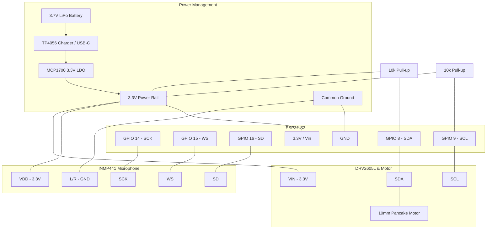

***

# EGEC 463: Voice-Based Stress Analysis
**Author:** Willie Jarin

This project bridges the gap between hardware signal acquisition and software-based digital signal processing (DSP). This document outlines the foundational code for the ESP32-S3 firmware, a Python data logger, and the MATLAB analysis scripts.

---

## 1. ESP32-S3 Firmware (Audio Capture)

The following code configures the **INMP441** microphone using the **I2S (Inter-IC Sound)** protocol. It captures raw audio data and transmits it over Serial to MATLAB for analysis.

```cpp
/*
* Project: Neck-Worn Wearable for Voice-Based Stress Analysis
* Hardware: ESP32-S3, INMP441 MEMS Microphone
*/

#include <driver/i2s.h>

// I2S Pin Configuration
#define I2S_WS 15
#define I2S_SD 16
#define I2S_SCK 14
#define I2S_PORT I2S_NUM_0
#define BUFFER_LEN 1024

void setup() {
  Serial.begin(115200);
  
  // I2S Configuration
  const i2s_config_t i2s_config = {
    .mode = (i2s_mode_t)(I2S_MODE_MASTER | I2S_MODE_RX),
    .sample_rate = 16000, // 16kHz sampling rate for voice
    .bits_per_sample = I2S_BITS_PER_SAMPLE_32BIT,
    .channel_format = I2S_CHANNEL_FMT_ONLY_LEFT,
    .communication_format = I2S_COMM_FORMAT_STAND_I2S,
    .intr_alloc_flags = ESP_INTR_FLAG_LEVEL1,
    .dma_buf_count = 8,
    .dma_buf_len = BUFFER_LEN,
    .use_apll = false
  };

  const i2s_pin_config_t pin_config = {
    .bck_io_num = I2S_SCK,
    .ws_io_num = I2S_WS,
    .data_out_num = -1, // Not used
    .data_in_num = I2S_SD
  };

  i2s_driver_install(I2S_PORT, &i2s_config, 0, NULL);
  i2s_set_pin(I2S_PORT, &pin_config);
}

void loop() {
  int32_t samples[BUFFER_LEN];
  size_t bytes_read;

  // Read data from I2S
  i2s_read(I2S_PORT, &samples, sizeof(samples), &bytes_read, portMAX_DELAY);

  // Send raw data to Serial for MATLAB processing
  if (bytes_read > 0) {
    for (int i = 0; i < bytes_read / 4; i++) {
      Serial.println(samples[i]);
    }
  }
}
```

---

## 2. MATLAB Signal Processing Script

This script handles the digital band-pass filtering (300Hz–3kHz) and extracts the fundamental frequency (pitch), a key biomarker for stress.

```matlab
% Project: Voice-Based Stress Analysis Preprocessing
% Purpose: Filter noise and extract vocal prosody features

fs = 16000; % Sampling frequency matching ESP32
duration = 5; % 5-second window

% 1. Data Acquisition (Simulated or Serial)
% s = serialport('COM3', 115200);
% rawData = read(s, fs * duration, "int32");

% 2. Digital Band-Pass Filter (300Hz - 3kHz)
bpFilter = designfilt('bandpassiir', 'FilterOrder', 8, ...
 'HalfPowerFrequency1', 300, 'HalfPowerFrequency2', 3000, ...
 'SampleRate', fs);
filteredAudio = filter(bpFilter, double(rawData));

% 3. Feature Extraction: Pitch (Vocal Prosody)
[f0, idx] = pitch(filteredAudio, fs);

% 4. Visualization
subplot(2,1,1);
plot(filteredAudio);
title('Filtered Vocal Signal (300Hz-3kHz)');
xlabel('Samples'); ylabel('Amplitude');

subplot(2,1,2);
plot(f0);
title('Vocal Pitch Tracking (F0)');
xlabel('Frame Index'); ylabel('Frequency (Hz)');

% 5. Simple Stress Logic
avgPitch = mean(f0, 'omitnan');
if avgPitch > threshold 
    disp('Feedback: Elevated Stress Detected');
else
    disp('Feedback: Calm State');
end
```

---

## 3. Project Roadmap & Implementation

### Recommended File Structure
*   **/Firmware**: Contains the `.ino` file for the ESP32-S3.
*   **/MATLAB**: Analysis scripts for pitch, tone, and loudness.
*   **/Data**: Storage for raw `.csv` or `.wav` samples.
*   **/Hardware**: 3D print files (STL) and circuit schematics.

### Implementation Checklist (Weeks 6-11)
*   **Data Capture**: Ensure the INMP441 is configured for 16kHz to capture the full range of human voice (300Hz–3kHz).
*   **Privacy Guardrails**: Process data locally or via direct transfer to MATLAB without cloud uploading.
*   **Noise Isolation**: Apply Digital Band-Pass Filters in MATLAB immediately to strip out background hum.

### Regulatory Note
This is positioned as a **wellness device**, not a medical tool. To avoid FDA Class II requirements, ensure presentation materials emphasize "stress awareness" rather than a "medical diagnosis."

---

## 4. Hardware Integration: Haptic Feedback

Using a **DRV2605L Haptic Driver** and a **Vibration Motor**, the system provides physical feedback when stress is detected.

### Haptic Driver Code (ESP32)
```cpp
#include <Wire.h>
#include "Adafruit_DRV2605.h"

Adafruit_DRV2605 drv;

void setupHaptics() {
  drv.begin();
  drv.selectLibrary(1);
  drv.setMode(DRV2605_MODE_INTTRIG); 
}

void triggerStressAlert() {
  drv.setWaveform(0, 47); // "Sharp Tick" - alert for elevated stress
  drv.setWaveform(1, 0);  // End waveform
  drv.go();
}
```

### Feedback Reception Code
Add this to your main `loop()` to process the signal from MATLAB:

```cpp
if (Serial.available() > 0) {
  char command = Serial.read();
  if (command == 'S') { // 'S' for Stress detected
    triggerStressAlert();
    Serial.println("Haptic Alert Triggered");
  }
}
```

---

## 5. The Serial Bridge (Python Data Logger)

This script captures the raw I2S data from the ESP32 via USB and saves it as a `.wav` file for permanent storage.

```python
import serial
import wave
import struct

# Configuration
SERIAL_PORT = 'COM3' 
BAUD_RATE = 115200
SAMPLE_RATE = 16000
OUTPUT_FILE = "vocal_sample_raw.wav"

ser = serial.Serial(SERIAL_PORT, BAUD_RATE)
print(f"Recording from {SERIAL_PORT}...")

with wave.open(OUTPUT_FILE, 'wb') as wav_file:
    wav_file.setnchannels(1) 
    wav_file.setsampwidth(4) # 32-bit
    wav_file.setframerate(SAMPLE_RATE)
    try:
        while True:
            line = ser.readline().decode('utf-8').strip()
            if line:
                try:
                    sample = int(line)
                    wav_file.writeframes(struct.pack('<i', sample))
                except ValueError:
                    continue
    except KeyboardInterrupt:
        print("Recording stopped. File saved.")
        ser.close()
```

---

## 6. Biomarker Analysis: Jitter & Shimmer

This MATLAB script identifies "micro-tremors" in the vocal folds—**Jitter** (frequency variation) and **Shimmer** (amplitude variation)—which indicate anxiety.

```matlab
[audio, fs] = audioread('vocal_sample_raw.wav');

% 1. Filter & Extract Pitch/Amplitude
bpFilter = designfilt('bandpassiir', 'FilterOrder', 8, ...
 'HalfPowerFrequency1', 300, 'HalfPowerFrequency2', 3000, 'SampleRate', fs);
cleanAudio = filter(bpFilter, audio);
[f0, ~] = pitch(cleanAudio, fs);
[upperEnv, ~] = envelope(cleanAudio);

% 2. Calculate Biomarkers
jitter = mean(abs(diff(f0)), 'omitnan') / mean(f0, 'omitnan');
shimmer = mean(abs(diff(upperEnv))) / mean(upperEnv);

% 3. Stress Logic
if jitter > 0.02 || shimmer > 0.15 
    disp('Result: Elevated Stress Level Detected');
else
    disp('Result: Calm State');
end
```

---

## 7. Hardware & Wiring Specifications

### Comparison: Python vs MATLAB
| Feature | Python Logger | MATLAB Analysis |
| :--- | :--- | :--- |
| **Primary Use** | **Data Acquisition**: Captures and saves raw audio data. | **Signal Processing**: Extracts biomarkers and analyzes stress. |
| **Real-Time Ability** | Excellent for streaming high-speed serial data. | Better for batch processing or deep statistical analysis. |
| **Hardware Link** | Talks directly to the USB-C port. | Processes files generated by Python or local buffers. |

### I2C Pin Mapping (DRV2605L to ESP32-S3)
| DRV2605L Pin | ESP32-S3 Pin | Purpose |
| :--- | :--- | :--- |
| **VIN** | **3.3V** | Power (LDO/Battery) |
| **GND** | **GND** | Common Ground |
| **SCL** | **GPIO 9** | I2C Clock |
| **SDA** | **GPIO 8** | I2C Data |

### Unified Wiring Schematic
| Component | Signal Type | ESP32-S3 Pin | Purpose |
| :--- | :--- | :--- | :--- |
| **INMP441 Mic** | **I2S (Digital Audio)** | GPIO 14, 15, 16 | Captures vocal biomarkers. |
| **DRV2605L Driver** | **I2C (Control)** | GPIO 8, 9 | Controls haptic feedback. |
| **MCP1700 LDO** | **Power** | 3.3V Out | Regulates battery to steady 3.3V. |
| **TP4056 Module** | **Power** | LiPo & USB-C | Safely charges the 3.7V battery. |

### Critical Wiring Requirements
*   **Pull-up Resistors**: Connect **10kΩ resistors** between the SDA/SCL lines and 3.3V. Without these, the I2C bus will float.
*   **Voltage Consistency**: Ensure the DRV2605L is powered by the **3.3V LDO**, not raw battery voltage.
*   **Microphone Isolation**: Mount the INMP441 near the edge of the board, pointing toward the user's throat.
*   **Short Data Lines**: Keep I2S and I2C wiring as short as possible to prevent ambient noise interference.
Since I am an AI, I cannot provide a `.jpg` or `.png` file directly, but I can provide you with a **Mermaid.js diagram**. 


---
### 8. The Visual Diagram (Mermaid Code)




---

### 9. Detailed Wiring Table (For Assembly)

If you are giving this to (Integration) for soldering, this table is the "Master Key":

| From Component | Pin | To Component | Pin | Notes |
| :--- | :--- | :--- | :--- | :--- |
| **Battery** | Positive (+) | **TP4056** | B+ | |
| **Battery** | Negative (-) | **TP4056** | B- | |
| **TP4056** | OUT+ | **MCP1700** | Vin | |
| **MCP1700** | Vout | **3.3V Rail** | -- | Powers ESP32, Mic, and Driver |
| **INMP441** | VDD | **3.3V Rail** | -- | |
| **INMP441** | GND / L/R | **Ground Rail** | -- | Connect L/R to GND for Left Channel |
| **INMP441** | SCK | **ESP32-S3** | GPIO 14 | I2S Clock |
| **INMP441** | WS | **ESP32-S3** | GPIO 15 | I2S Word Select |
| **INMP441** | SD | **ESP32-S3** | GPIO 16 | I2S Serial Data |
| **DRV2605L** | VIN | **3.3V Rail** | -- | |
| **DRV2605L** | GND | **Ground Rail** | -- | |
| **DRV2605L** | SDA | **ESP32-S3** | GPIO 8 | **Requires 10kΩ Pull-up to 3.3V** |
| **DRV2605L** | SCL | **ESP32-S3** | GPIO 9 | **Requires 10kΩ Pull-up to 3.3V** |
| **DRV2605L** | OUT+ / - | **Pancake Motor** | Red / Blue | |

---

### 10. Assembly Tips for the Team:

1.  **I2C Pull-ups (Critical):** Do not skip the **10kΩ resistors**. Connect one end of a resistor to **GPIO 8 (SDA)** and the other end to **3.3V**. Do the same for **GPIO 9 (SCL)**. Without these, the ESP32 will "hang" when trying to talk to the haptic motor.
2.  **Star Grounding:** Ensure all "GND" pins meet at a single point (the TP4056 OUT- or MCP1700 GND pin) to reduce electrical noise in the audio signal.
3.  **LDO Placement:** The **MCP1700** is sensitive to heat. Solder it last, and ensure it is not touching the battery or the ESP32-S3 (both of which get warm).
4.  **Wire Length:** Keep the 3 wires going to the **INMP441 Microphone** (SCK, WS, SD) as short as possible. I2S signals are high-speed and can pick up "hum" if the wires are too long.
